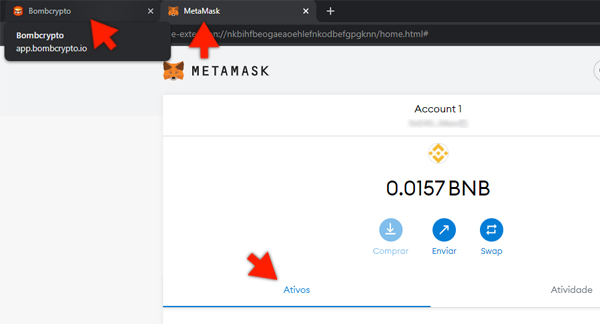

# FM-bombcrypto-bot

Antes de começar, fique sempre de olho no **[CHANGELOG](CHANGELOG.md)** para saber
quais foram as últimas atualizações do Bot, obrigado!

Bot de código aberto para o [Bombcrypto](https://bombcrypto.io/),
desenvolvido para ajudar a comunidade nos ganhos
enquanto vivem suas vidas, roda 24h por dia, 7 dias
por semana, 4 semanas por mês, 12 meses por ano. Enquanto
houver internet e o pc não travar! Hehe.

## Você de longe, sabendo de tudo

O Bot é capaz de se conectar ao **Telegram** e notificá-lo
sobre tudo o que ele está fazendo, o arquivo
**conf.py** te dá instruções de como conectar o
FM-bombcrypto-bot ao **seu chatbot pessoal**.

## Capacidades
O bot funciona, tanto com uma, como com várias contas
abertas ao mesmo tempo, você só precisa ter o cuidado
de deixar a(s) janela(s) com apenas duas abas, uma para
o **Bomcrypto** e outra para a **Metamask em tela cheia**,
como na imagem de exemplo a seguir:

Se você optar pelo login com **username e password** introduzido
na versão **33** do jogo, não será necessária a aba com a Metamask
aberta, se você tiver várias contas, basta abrir mais uma aba com o jogo
e configurar os usernames e passwords na variável **login_credentials**,
no arquivo **conf.py**. O número de abas abertas deve ser igual ao
número de usuários e senhas configurados! Esteja avisado.

Ou seja, ele é **multi-account** e também **multi-platform**,
pois roda no Windows, Linux, Mac... coisa boa hein? Quanto ao
funcionamento, ele é bem simples:
* Executa o login (comum ou via Metamask) assinando os termos de uso quando solicitado.
* Coloca os bheroes para trabalhar, **todos de uma vez**.
* De x em x segundos (**time_to_refresh**, configurável), volta à tela inicial
e sai do jogo (para fugir dos bugs de bheroes eventualmente
parados no mapa, bugs de rollback e bugs de baús com
vida infinita).
* Se o **time_to_refresh** foi atingido, executa o login
e vai direto para o treasure hunt, pois os bheroes já
foram colocados para trabalhar.
* De x em x segundos (**time_to_rest**, configurável),
volta à tela inicial e reseta o tempo de descando dos
bheroes, de forma que no próximo login, todo o processo
seja repetido novamente, para sempre, o **time_to_rest**
sempre deve ser maior que o **time_to_refresh**, o arquivo
**conf.py** tem as instruções de cada variável.

Este é o fluxo do bot! Futuramente, novas funcionalidades
poderão ser adicionadas (ou não).

## Limitações
O bot fica analizando prints da sua tela no momento
do jogo e comparando com imagens requeridas de forma frequente, assim ele sabe
onde clicar, como ele foi projetado para rodar também em computadores
mais fracos e consumir o mínimo de memória possível, o reconhecimento
de imagem foi simplificado, por essa razão, foi
criada a variável de configuração **threshold**, que
regula o nível de confiança para o bot considerar que
encontrou a imagem requerida, entendeu? Essa variável também
encontra-se no arquivo **conf.py**, se mesmo após vários
testes com a regulagem, o bot ainda continuar clicando
no lugar inesperado, entre na pasta **pics** onde
encontram-se todos os "alvos clicáveis" e substitua
a imagem que ele está errando, pela mesma imagem, na
sua resolução, assim irá funcionar. **Lembre-se de salvar
a imagem com o mesmo nome e extensão**.

## Instalação
* Baixe e instale a última versão do **Python** disponível
  no [site oficial](https://www.python.org/downloads/).
* Faça o download do ZIP do projeto e extraia a pasta
para o local de sua preferência.
* Copie todo o caminho de onde você salvou a pasta do
projeto, por exemplo: **caminho/salvo/fm-bombcrypto-bot**
* Abra o terminal.
* No terminal, navegue até o diretório copiado
anteriormente digitando **cd caminho/salvo/fm-bombcrypto-bot**,
obviamente, o caminho será colado no terminal.
* Instale as dependências do projeto digitando o comando
**pip install -r requirements.txt**.
* Se você utiliza Linux, rode também o seguinte comando no
terminal: **apt install scrot python3-tk python3-dev**.
  
## Utilização
* Configure as variáveis de sua preferência no arquivo
**conf.py**, se necessário.
* Com as janelas (ou abas, dependendo do tipo de login) do browser já abertas, como explicado
ali em capacidades, execute o comando:
**python caminho/salvo/fm-bombcrypto-bot/main.py** e
aperte ENTER.
* Para cancelar o bot, basta executar um **Ctrl + c**
no terminal.
  
## Conseguimos te ajudar?
### Consegue ganhar dinheiro enquanto faz outras coisas utilizando nosso bot?
Se a resposta for sim, que bom que te ajudamos! Para
ajudar o projeto a crescer mais ainda e motivar as
pessoas por trás disso, considere fazer uma doação.
Utilize o QR-Code ou copie o endereço da carteira
do projeto para transferir.

**0x180d671110Cff51Ac9Efdb786669161D2b556F4a**

